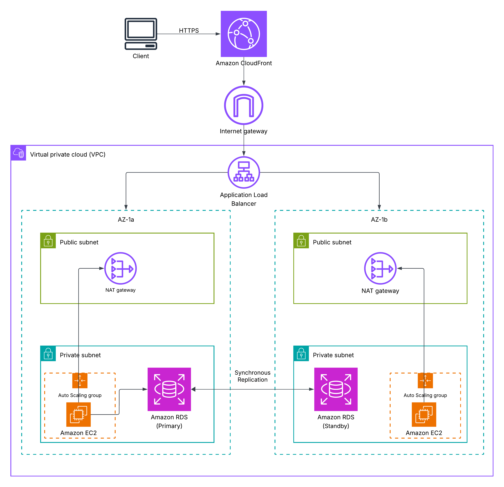

# AWS Well-Architected Framework (WAF) and Cloud Adoption Framework (CAF) Assessment

## Task 1: Review the Existing Architecture

### Components of the Workload
The existing on-premises architecture consists of a two-tier web application:
- **Frontend**: Web servers handling user requests, application logic, and serving static/dynamic content.
- **Backend**: A database server storing application data, likely a relational database such as MySQL or PostgreSQL.

This setup is being migrated to AWS, potentially via a lift-and-shift approach using EC2 instances for both tiers.

### Potential Risks or Weaknesses
Based on the background and common migration pitfalls:
- No backup strategy: Data loss risk from hardware failures or errors, with no automated snapshots or recovery points.
- Single-AZ deployment: Vulnerability to Availability Zone outages, leading to downtime without failover.
- Open security groups: Overly permissive inbound rules (e.g., allowing all traffic on port 80/443 or database ports), increasing exposure to unauthorized access.
- Lack of scaling: Fixed resources unable to handle variable traffic, risking performance degradation or over-provisioning.
- No monitoring or logging: Limited visibility into application health, errors, or resource utilization.
- Manual operations: Reliance on manual processes for deployments, updates, and management, prone to human error.

These issues highlight the need for alignment with AWS best practices during migration.

## Task 2: Evaluate the Workload Using the AWS Well-Architected Framework

For each of the five pillars, I've identified one strength based on the simple two-tier design and one area for improvement considering the risks noted in Task 1. The table summarizes the findings, with "Observation" capturing the strength, "Improvement Recommendation" addressing the area for improvement with a specific action, and "Supporting AWS Service" suggesting an enhancement.

| Pillar                | Observation (Strength)                          | Improvement Recommendation (Area for Improvement) | Supporting AWS Service |
|-----------------------|-------------------------------------------------|----------------------------------------------------|------------------------|
| Operational Excellence | The simple two-tier structure allows for straightforward initial setup and management with minimal components. | Implement automated monitoring, alerting, and CI/CD pipelines to reduce manual interventions and improve operational efficiency. | AWS CloudWatch (for metrics, logs, and alarms) and AWS CodePipeline (for automation). |
| Security             | Basic on-premises access controls can be directly mapped to AWS IAM for user management. | Enforce least-privilege access, encrypt data in transit/rest, and restrict security groups to prevent unauthorized access. | AWS IAM (for roles and policies) and AWS KMS (for encryption). |
| Reliability          | The application's tiered design separates concerns, making it easier to isolate failures. | Deploy across multiple AZs with auto-scaling and automated backups to ensure high availability and quick recovery from failures. | Amazon RDS Multi-AZ (for database failover) and Auto Scaling Groups (for frontend resilience). |
| Performance Efficiency | On-premises hardware can be right-sized in AWS using efficient instance types for compute needs. | Use load balancing and caching to handle varying loads efficiently, avoiding over-provisioning. | Elastic Load Balancing (ELB) and Amazon ElastiCache (for caching). |
| Cost Optimization    | Migration to AWS enables pay-as-you-go pricing, reducing upfront hardware costs. | Implement resource tagging, reserved instances, and auto-scaling to optimize spending and avoid idle resources. | AWS Cost Explorer (for analysis) and AWS Savings Plans (for discounts). |

## Task 3: Apply the AWS Cloud Adoption Framework (CAF)

Using the six CAF perspectives, I've analyzed the organization's readiness for cloud transformation. Assuming a mid-sized organization with limited cloud experience, traditional IT practices, and a focus on cost control during migration. For each perspective, I've identified readiness gaps, key actions, and enablers.

### Business Perspective
The business perspective evaluates alignment between cloud adoption and organizational goals. Currently, the organization views the migration primarily as a cost-saving measure, with management emphasizing quick wins like reduced on-premises maintenance. However, there's limited strategic planning for long-term benefits such as innovation or agility. Readiness is moderate: leadership supports the move, but lacks a clear business case tying the two-tier app to revenue growth or customer experience improvements.

Key actions include developing a cloud business office to define KPIs (e.g., time-to-market reductions) and conducting value assessments. Enablers: Engage executive sponsors for buy-in and use AWS Migration Evaluator to quantify ROI. Training business stakeholders on cloud economics via AWS Business Builder programs would help. Overall, prioritizing business outcomes over tactical migration will ensure the project delivers measurable value, fostering a culture of continuous improvement. (162 words)

### People Perspective
This perspective focuses on skills, culture, and workforce transformation. The organization has experienced IT staff familiar with on-premises systems but limited AWS expertise, leading to potential resistance due to fear of skill obsolescence. Readiness is low: No formal training programs exist, and teams are siloed, hindering collaboration.

Key actions: Implement a cloud center of excellence (CCoE) with cross-functional teams and roll out role-based training (e.g., AWS Certified Developer for devs). Enablers include AWS Skills Builder for self-paced learning and change management workshops to address cultural shifts. Partnering with AWS Training and Certification can upskill staff on WAF/CAF. By investing in people, the organization can build internal capabilities, reduce dependency on external consultants, and promote a cloud-native mindset, ultimately accelerating adoption and reducing migration risks. (158 words)

### Governance Perspective
Governance assesses controls for risk management, compliance, and resource oversight. The organization has basic on-premises policies but lacks cloud-specific governance, such as centralized account management or compliance automation. Readiness is fair: Financial controls are in place, but no mechanisms for enforcing standards across AWS environments.

Key actions: Establish a cloud governance framework with policies for tagging, access, and auditing. Enablers: Use AWS Organizations for multi-account strategy and AWS Config for compliance monitoring. Implement AWS Control Tower for landing zones with guardrails. Regular governance reviews and integration with existing risk frameworks (e.g., aligning with ISO standards) are essential. This will mitigate risks like shadow IT or cost overruns, ensuring accountable and scalable cloud operations while maintaining regulatory compliance during the migration. (152 words)

### Platform Perspective
The platform perspective covers foundational infrastructure and tools for cloud environments. Currently, the organization relies on legacy tools incompatible with AWS, with no standardized provisioning processes. Readiness is low: Manual setups risk inconsistencies, and there's no hybrid connectivity planned.

Key actions: Build a secure, scalable foundation using AWS Landing Zone best practices. Enablers: AWS VPC for networking, AWS Direct Connect for hybrid links, and Infrastructure as Code (IaC) with AWS CloudFormation. Automate environment setups to support the two-tier app's needs. By focusing on platform maturity, the organization can enable rapid provisioning, reduce setup time, and support future workloads, turning the migration into a stepping stone for broader cloud capabilities. (148 words)

### Security Perspective
Security evaluates protections for data, identities, and infrastructure. The on-premises setup has basic firewalls, but migration exposes gaps like unencrypted data and weak identity management. Readiness is moderate: Awareness of threats exists, but no zero-trust model or automated detection.

Key actions: Adopt a shared responsibility model with layered security controls. Enablers: AWS WAF for web protection, Amazon GuardDuty for threat detection, and encryption via KMS. Conduct security assessments using AWS Inspector. Integrating with CAF security best practices will address vulnerabilities in the two-tier app, such as securing database access. This proactive approach ensures compliance, reduces breach risks, and builds trust in cloud operations. (154 words)

### Operations Perspective
Operations focus on day-to-day management, monitoring, and incident response. The organization uses manual monitoring tools, lacking automation for alerts or scaling. Readiness is low: No 24/7 support model, risking downtime during migration.

Key actions: Shift to proactive operations with automated workflows. Enablers: AWS Systems Manager for patching, CloudWatch for monitoring, and AWS X-Ray for tracing. Implement incident management with AWS Service Health Dashboard. By maturing operations, the organization can achieve higher uptime for the web app, minimize disruptions, and enable efficient resource use, aligning with WAF reliability pillars for a smooth transition. (150 words)

## Task 4: Design an Improved Architecture

### Revised AWS Architecture Description
The improved architecture migrates the two-tier web application to a highly available, secure, and scalable design on AWS, addressing all five WAF pillars.

**

- **Networking Foundation**: Deploy in a VPC with public and private subnets across multiple Availability Zones (AZs) for reliability.
- **Frontend Tier**: Use an Application Load Balancer (ALB) in public subnets to distribute traffic to an Auto Scaling Group (ASG) of EC2 instances (e.g., t3.medium) running the web application. This enables automatic scaling based on CPU utilization (Performance Efficiency, Reliability). Integrate Amazon CloudFront as a CDN for global caching and faster content delivery.
- **Backend Tier**: Migrate the database to Amazon RDS (e.g., PostgreSQL) in private subnets with Multi-AZ deployment for automated failover and backups (Reliability, Security). Enable read replicas for performance if needed.
- **Security Controls**: Use security groups to restrict traffic (e.g., ALB only allows HTTP/HTTPS, RDS only from frontend subnets). Implement IAM roles for least-privilege access, encrypt data with KMS, and enable AWS WAF on ALB for protection against common web exploits.
- **Monitoring and Operations**: Integrate CloudWatch for metrics/alarms, AWS X-Ray for tracing, and CloudTrail for auditing (Operational Excellence). Use AWS Backup for centralized data protection.
- **Cost Optimization**: Apply resource tagging for cost allocation, use Reserved Instances or Savings Plans for predictable workloads, and enable auto-scaling to match demand.
- **Additional Features**: For hybrid connectivity (if needed), use AWS Direct Connect or Site-to-Site VPN. Automate deployments with CodePipeline and IaC via CloudFormation.

This design ensures operational automation, robust security, fault tolerance, efficient performance, and cost control.

## Brief Reflection
Through this lab, I learned the practical application of AWS WAF and CAF in evaluating and improving cloud migrations. Identifying strengths and gaps in pillars like Reliability highlighted the importance of multi-AZ designs for resilience, while CAF perspectives emphasized holistic readiness beyond technology—such as people skills and governance. Designing the improved architecture reinforced how services like RDS and ALB integrate to meet best practices, and communicating via structured documentation sharpened my ability to justify decisions. Overall, it equipped me to approach real-world cloud projects critically and comprehensively.