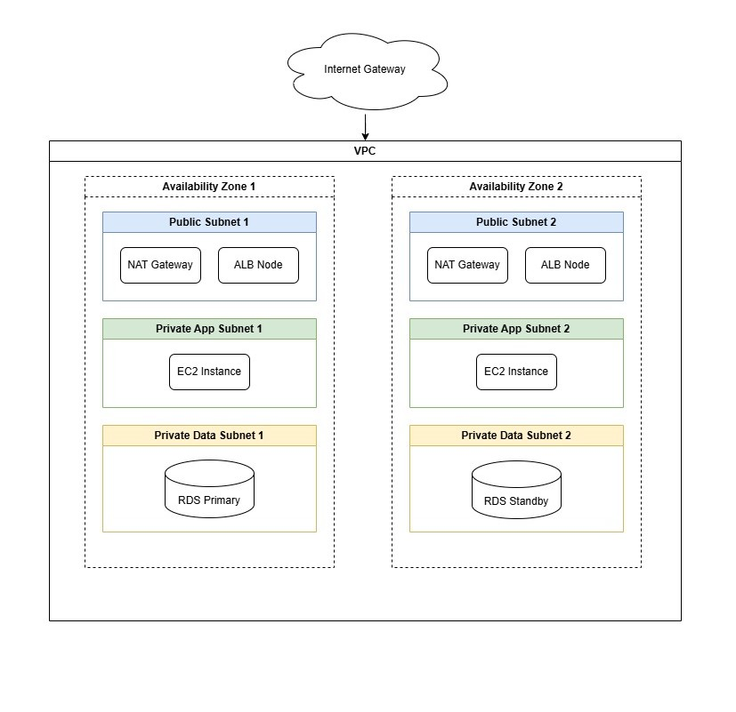

# Cloud Foundations Capstone: AWS Solution Design & Evaluation

## Project Overview
This project designs and evaluates a robust, scalable, and secure AWS solution for a **High Availability Web Application**. The goal is to migrate an on-premises workload to the cloud to improve reliability, scalability, and operational efficiency while optimizing costs. The solution leverages AWS managed services to reduce administrative overhead and adheres to the AWS Well-Architected Framework.

## Architecture

### Proposed Solution
The proposed architecture is a **Multi-AZ, 3-Tier Web Application** hosted within a custom Virtual Private Cloud (VPC). It separates concerns into presentation, application, and data layers, ensuring security and scalability.

### Architecture Diagram
**

### Key Components

#### 1. Networking
-   **VPC:** A custom VPC (e.g., `10.0.0.0/16`) provides network isolation.
-   **Subnets:**
    -   **Public Subnets:** Hosted in two Availability Zones (AZs) for the Application Load Balancer (ALB) and NAT Gateways.
    -   **Private Subnets (App):** Hosted in two AZs for the application servers (EC2) to prevent direct internet access.
    -   **Private Subnets (Data):** Hosted in two AZs for the RDS database instances.
-   **Internet Gateway (IGW):** Allows outbound traffic for the public subnets.
-   **NAT Gateways:** Allow instances in private subnets to access the internet (for updates) without being exposed to inbound traffic.

#### 2. Compute
-   **EC2 Auto Scaling Group:** Deploys application instances across multiple AZs in private subnets. It automatically adjusts capacity based on CPU utilization or request count.
-   **Application Load Balancer (ALB):** Distributes incoming traffic across the EC2 instances. It handles SSL termination and health checks.

#### 3. Database & Storage
-   **Amazon RDS (MySQL/PostgreSQL):** Deployed in a Multi-AZ configuration for high availability and automatic failover.
-   **Amazon S3:** Stores static assets (images, videos) and backups. Configured with versioning and lifecycle policies.
-   **Amazon EBS:** Provides persistent block storage for EC2 instances.

#### 4. Security & Identity
-   **IAM Roles:** Assigned to EC2 instances to grant secure access to S3 and other services without hardcoding credentials.
-   **Security Groups:** Act as virtual firewalls:
    -   *ALB SG:* Allows Inbound HTTP/HTTPS from `0.0.0.0/0`.
    -   *App SG:* Allows Inbound traffic only from the *ALB SG*.
    -   *DB SG:* Allows Inbound traffic only from the *App SG*.

---

## Well-Architected Framework Evaluation

### 1. Operational Excellence
*   **Infrastructure as Code (IaC):** The entire environment is provisioned using CloudFormation/Terraform, ensuring consistent and repeatable deployments.
*   **Monitoring:** Amazon CloudWatch tracks metrics (CPU, Latency) and triggers alarms for anomalies.
*   **Logging:** CloudTrail logs all API calls for auditing.

### 2. Security
*   **Defense in Depth:** Uses VPC, private subnets, NACLs, and Security Groups.
*   **Data Protection:**
    -   *At Rest:* EBS volumes and RDS databases are encrypted using AWS KMS. S3 buckets use server-side encryption (SSE-S3).
    -   *In Transit:* Traffic is encrypted via TLS (HTTPS) using certificates from AWS Certificate Manager (ACM).
*   **Identity:** Least privilege access is enforced via IAM policies.

### 3. Reliability
*   **Fault Tolerance:** The Multi-AZ architecture ensures that if one AZ fails, the application continues to run in the other AZ.
*   **Self-Healing:** The Auto Scaling Group replaces unhealthy instances automatically.
*   **Data Durability:** RDS Multi-AZ provides synchronous replication. S3 provides 99.999999999% durability.

### 4. Performance Efficiency
*   **Elasticity:** Auto Scaling adjusts resources to match demand, preventing over-provisioning.
*   **Caching:** (Optional) Amazon ElastiCache (Redis) can be added to cache database queries, and CloudFront can cache static content globally.
*   **Selection:** Right-sized EC2 instance types (e.g., t3.medium for general purpose) are selected based on workload testing.

### 5. Cost Optimization
*   **Right-Sizing:** Auto Scaling ensures we only pay for the compute we need.
*   **Storage Tiers:** S3 Lifecycle policies move infrequently accessed data to S3 Standard-IA or Glacier.
*   **Purchasing Options:** For steady-state workloads, Compute Savings Plans or Reserved Instances can reduce costs by up to 72%.

### 6. Sustainability
*   **Efficiency:** Maximizing utilization via Auto Scaling reduces energy waste.
*   **Managed Services:** Using shared services like S3 and RDS reduces the carbon footprint compared to managing physical hardware.

---

## Cloud Adoption Framework (CAF) Analysis

### Business Perspective
*   **Value:** Accelerates time-to-market for new features by leveraging agile infrastructure.
*   **Risk:** Reduces business risk through high availability and disaster recovery capabilities.

### People Perspective
*   **Training:** The team will upskill on AWS services and DevOps practices.
*   **Roles:** Establish a Cloud Center of Excellence (CCoE) to define standards and best practices.

### Governance Perspective
*   **Cost Management:** AWS Budgets and Cost Explorer will be used to track spend.
*   **Compliance:** AWS Config rules will enforce compliance with internal policies (e.g., "All volumes must be encrypted").

### Platform Perspective
*   **Standardization:** Use approved AMIs and CloudFormation templates to ensure a consistent platform.
*   **Modernization:** Plan to eventually refactor monolithic components into microservices (Lambda/Fargate).

### Security Perspective
*   **Incident Response:** Automated runbooks for common security events.
*   **Visibility:** Centralized logging and threat detection with Amazon GuardDuty.

### Operations Perspective
*   **Automation:** Patch Manager (Systems Manager) automates OS patching.
*   **Health:** Dashboards provide real-time visibility into system health.

---

## Implementation Plan
1.  **Phase 1: Foundation** - Set up AWS Organization, IAM users, and billing alerts.
2.  **Phase 2: Network** - Deploy VPC, Subnets, Route Tables, and IGW/NAT.
3.  **Phase 3: Data** - Provision RDS Multi-AZ and S3 buckets.
4.  **Phase 4: App Deployment** - Create Launch Templates, ASG, and ALB. Deploy code.
5.  **Phase 5: Cutover** - Update DNS (Route53) to point to the ALB.

## Prerequisites
-   Active AWS Account.
-   AWS CLI installed and configured.
-   Terraform installed (v1.0+).
